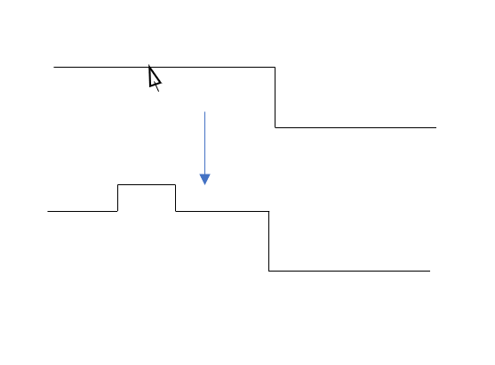

# Interface Documentation for BusWire Module

Owners:
 - Aditya Deshpande
 - Gautham Ravichandran

Any changes must be agreed by owners then communicated to the rest of the group.

Routing algorithm.

Has list of BusWires and list of Symbols.

Wires should be selectable: should do autorouting initially but be selectable and moveable in end product.

## Messages

**From Sheet**

`AddWire of (CommonTypes.PortId * CommonTypes.PortId)`
 - Creates connection between two ports specified in message.
 - Port types cannot be the same (i.e. one must be an input, one must be an output - order does not matter)
 - BusWire's handling of this message incorporates wire validation, protecting against:
   - Port type mismatch (trying to connect input to input, output to output)
   - Wire duplication (trying to draw a wire that already exists)
   - Port width mismatch (target port has different width to source port)
 
`DeleteWires of CommonTypes.ConnectionId list`
 - Deletes wires from model based on ID.

`HighlightWires of CommonTypes.ConnectionId list`
 - Highlights wires specified in the list.
    - Highlights the source and target ports of the wire.
 - Same functionality as highlighting a Symbol (need to send a Highlight message with an empty list to unhighlight everything).

`MoveWires of CommonTypes.ConnectionId * int * XYPos`
 - Takes a wire Id, segment index, and translation vector.
 - The specified segment is moved by the translation vector specified.
 - The whole wire is manually routed in accordance with the above.

`UpdateWidth of cId : CommonTypes.ConnectionId * w : int`
- Updates the with of a connection to value found from width inferer

`HighlightError of CommonTypes.ConnectionId list`
- Updates the wire to be error highlighted

`AddSegment of  CommonTypes.ConnectionId * int * XYPos`
- Takes a wire Id, segment index, and the position of the right-click.
- The specified segment is broken into five segments (three new segments are added as a hump) at the mouse position.

`SnapWire of CommonTypes.ConnectionId list`
- Takes a list of wire Ids and snaps the specified wires to the grid lines. 

## Interface Functions (called by Sheet)

`BusWire.getWireSegList (wireId : CommonTypes.ConnectionId) (wModel : Model) : ( CommonTypes.ConnectionId * int) list`
- Given a wireId and wire model, returns a list of tuples containing the wireId and the index of each segment for that wire.

`BusWire.getBoundingBoxes (mouseCoord: XYPos) (model : Model)`
 - Returns list of `(id: CommonTypes.ComponentId * topLeft: XYPos * bottomRight: XYPos)`
 - Initially just returns all bounding boxes.

 - Returns a flat list:
   - Each wire has one ID but multiple bounding boxes 
   - A single WireID may appear multiple times accompanying a different bounding box of the wire.

    | `CommonTypes.ComponentId` |` XYPos` | `XYPos` |   
    |----------|---------|---------|
    | WireID 1 | TopL 1A | BotR 1A |   
    | WireID 1 | TopL 1B | BotR 1B |   
    | WireID 2 | Top L2  | Bot R2  |   
    | WireID 3 | Top L3  | Bot R3  |

`BusWire.extractWires (wModel : Model) : CommonTypes.Connection list`
- This function will convert the wire model from the Wire datatype into the ISSIE-compliant Connection datatype

`BusWire.getWires (wModel : Model) (cIdList : CommonTypes.ConnectionId list) : CommonTypes.ConnectionId list`
- Takes a connectionId list and returns the connections in the model not in that list

`BusWire.connectedSymbols (wModel : Model) (connect : CommonTypes.ConnectionId) : CommonTypes.ComponentId list`
- Takes a ConnectionId and returns the Symbol IDs connected to that connection

`BusWire.chooseWiresToUpdate (sIdList: CommonTypes.ComponentId list) (model: Model) (sm: Symbol.Model)`
- Calculates and returns the IDs of wires that must be updated using a provided list of symbols that have been updated.

`BusWire.getWireIdsFromPortIds (wModel: Model) (portIds: CommonTypes.PortId list) : CommonTypes.ConnectionId list`
 - Takes a list of PortIds as input and returns the IDs of all the wires connected to the supplied ports.

`BusWire.connectToWire (wModel : Model) (connect : CommonTypes.ConnectionId) : Wire`
 - Takes a connectionId and returns the wire object associated with it

`BusWire.connectToPort (wModel : Model) (connect : CommonTypes.ConnectionId) : (CommonTypes.PortId * CommonTypes.PortId)`
- Takes a ConnectionId and returns the (source port, target port) associated with that connection

`connectedSymbols (wModel : Model) (connect : CommonTypes.ConnectionId) : CommonTypes.ComponentId list`
- Takes a ConnectionId and returns the Symbol IDs connected to that connection

## Issie Interface functions

`segToVert (wSegs : WireSegment list) : (float * float) list`
- Converts a wire segment list into a list of distinct vertices
    
`wireToIssie (wire : Wire) (wModel : Model) : CommonTypes.Connection`
- Converts the Wire type into the Issie Connection type

`extractWires (wModel: Model) : CommonTypes.Connection list`
- Converts the wire model from a Wire list to an Issie Connection list

## Interface Functions (called by BusWire)

`Symbol.getPortCoords (symbolModel : Model) (portID: CommonTypes.PortId)`
 - Used by BusWire for connecting wires to ports.
 - Returns `XYPos`.

`Symbol.getPortType (symbolModel : Model) (portID: CommonTypes.PortId)`
 - Returns if port is input or output.

`Symbol.getPortWidth (model : Model) (pId : CommonTypes.PortId) : int`
 - Returns width of specified port.

 `Symbol.getPortEdge (model : Model) (pId : PortId) : Edge`
 - Returns which edge of the symbol a port lies on.

`Symbol.getHostId (model : Model) (pId : CommonTypes.PortId) : CommonTypes.ComponentId`
 - Returns the ComponentID which the PortID belongs to.

 `Symbol.getPortEdge (model : Model) (pId : CommonTypes.PortId) : Edge`
 - Returns the edge of the symbol that the port is on

 `Symbol.getPortIds (model : Model) (sId : ComponentId) : PortId list`
 - Returns a list of PortIds for the ports on a given symbol.

 `Symbol.getPort (model : Model) (pId : PortId) : Port`
 - Returns the CommonTypes.Port object of a given pId
 - Used by buswire to convert to Issie datatypes

